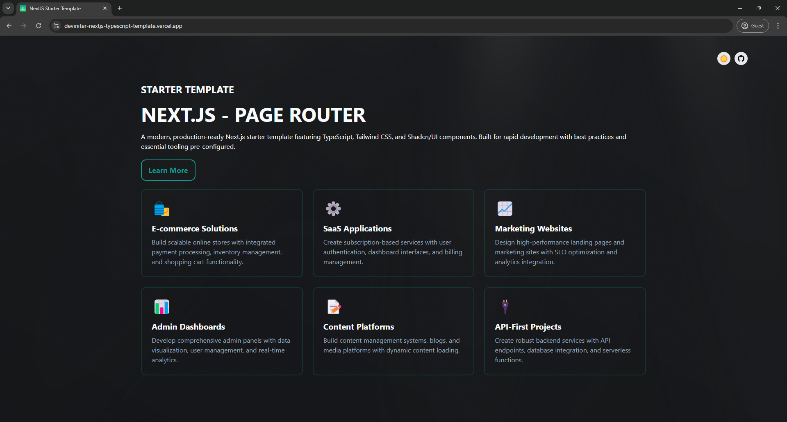
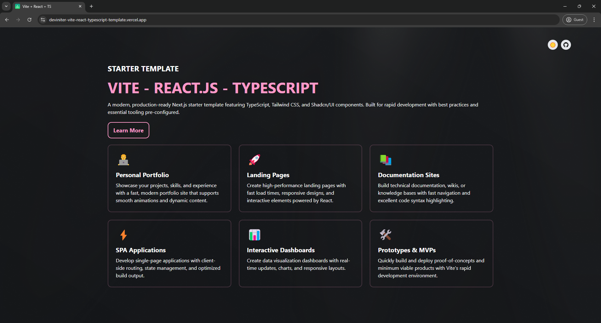
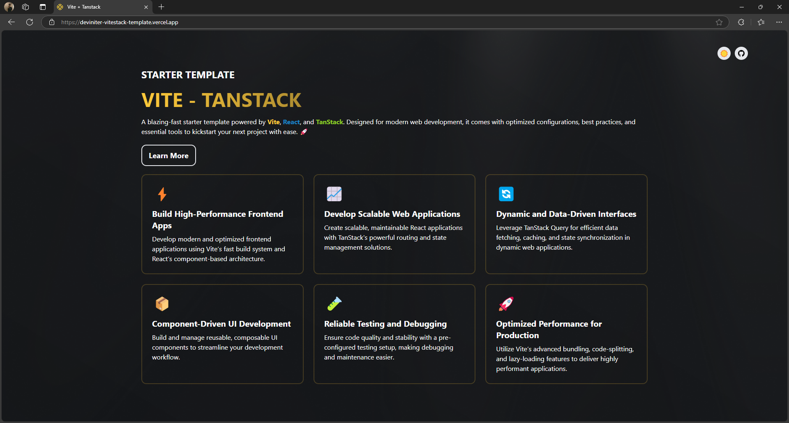

<a id="readme-top"></a>

<div align="center">
  <a href="https://github.com/Pet3r1512/DevIniter">
    
  </a>

  <div align="center"> <a href="https://github.com/Pet3r1512/DevIniter_CLI/releases">
    
  </a> </div>

  <p align="center">
    Initialize Developer's Projects with Pre-built Templates
    <br />
    <a href="https://deviniter.site/docs/introduction"><strong>Explore the docs »</strong></a>
    <br />
    <br />
    <a href="https://github.com/Pet3r1512/DevIniter_CLI/issues/new?template=bug-report---.md">Report Bug</a>
    ·
    <a href="https://github.com/Pet3r1512/DevIniter_CLI/issues/new?template=feature-request---.md">Request Feature</a>
  </p>
</div>

- ⚡ Start your project within under 60 seconds
- ⚙️ Rich technologies and tools

<p align="right">(<a href="#readme-top">back to top</a>)</p>

## Built With

- TypeScript
- Execa
- Ora
- Inquirer
- Tsup
- Vitest
- Changeset

<p align="right">(<a href="#readme-top">back to top</a>)</p>

## Templates

Until now, DevIniter provides 3 templates: Next.js - Page Router, Vite - React.js and Vitestack

###  Next.js - Page Router

<a href="https://deviniter-nextjs-typescript-template.vercel.app/" target="_blank"></a>

###  Vite - React.js

<a href="https://deviniter-vite-react-typescript-template.vercel.app/" target="_blank"></a>

###  ViteStack

<a href="https://deviniter-vitestack-template.vercel.app/" target="_blank"></a>

<p align="right">(<a href="#readme-top">back to top</a>)</p>

### Prerequisites

Ensure you have the following tools installed on your system:

- Nodejs (v20.0.0 or higher)

- npm (v10.0.0 or higher)
- pnpm (v9.0.0 or higher)
- yarn (v4.0.0)

<strong>Note</strong>: We are actively working to expand support for additional Node.js versions and package managers such as Bun.

### Installation

Installing your favorite template by running:

- Using npm:

```bash
  npx @deviniter/cli@latest
```

- Using pnpm

```bash
  pnpm dlx @deviniter/cli@latest
```

- Using yarn (beta)

```bash
  yarn dlx @deviniter/cli@latest
```

_For more examples, please refer to the [Documentation](https://www.deviniter.site/docs/introduction)_

<p align="right">(<a href="#readme-top">back to top</a>)</p>

## Top Contributors

This project exists thanks to all the people who contribute. [[Contribute](CONTRIBUTING.md)].

<a href="https://github.com/Pet3r1512/DevIniter_CLI/graphs/contributors">
  
</a>

<p align="right">(<a href="#readme-top">back to top</a>)</p>

## License

Distributed under the MIT License. See [LICENSE](https://github.com/Pet3r1512/DevIniter_CLI/blob/feature/contributing-docs/FEAT-007/LICENSE) for more information.

<p align="right">(<a href="#readme-top">back to top</a>)</p>

## Contact

Peter Pham - peter1512.dev@gmail.com - [X Profile](https://x.com/Thnh_Phng_) - [LinkedIn](https://www.linkedin.com/in/peter-pham-6b02a2229)

Project Link: [https://github.com/Pet3r1512/DevIniter_CLI](https://github.com/Pet3r1512/DevIniter_CLI)

<p align="right">(<a href="#readme-top">back to top</a>)</p>
